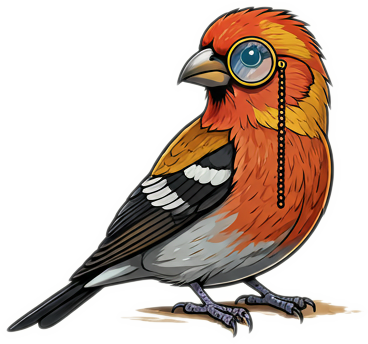

PINN Library
---

This repository is an organized set of examples of physically informed neural networks (PINN).  The paper which originally coined this term can be found [here](https://www.sciencedirect.com/science/article/pii/S0021999118307125) and a nice review is [here](https://www.nature.com/articles/s42254-021-00314-5).  The [CRUNCH group](https://sites.brown.edu/crunch-group/) at Brown University has a nice [YouTube channel](https://www.youtube.com/@CrunchGroup) which organizes routine lectures on the subject, and is a nice reference.

This repository is organized into (sub)folders with examples illustrating the development of PINNs for different use cases.  These are mostly standalone so they may be copied and modified without much, if any, dependence on the rest of this repository.

Citation
---
The logo for this repository was generated using Google Gemini (Imagen 3) on Dec. 10, 2024 with the prompt "Draw a cartoon of a pine grosbeak bird with a monocle."  The pine grosbeak ([PIN]icola e[N]ucleator) is a member of the finch family and was chosen based on its scientific name.
